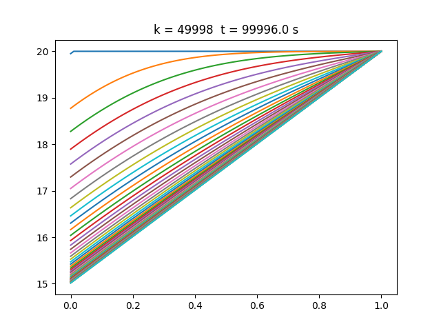

# MCOC2020-P3

CONDICIONES DE BORDE NATURALES AL CASO 1-D:

Para obtener la condición de borde natural en el lado izquierdo, se aplico la siguiente condicion de borde:

Aproximando la condición de borde por medio de sus diferencias finitas de primer orden para el tiempo constante, fijandonos en el puesto 0 y comparandolo con el puesto 1:

Al reordenar la ecuación:

De esta forma obtenemos un nuevo stencil de diferencias finitas (pequeño) que nos permite completar el valor faltante.

Despues de agregar la linea anterior al codigo y usando los mismos parámetros de los ejemplos de clases. Se realizo el gráfico con un paso de integración dt = 2s y curvas de evolución térmica cada 1000 pasos hasta llegar a 50000 pasos. El grafico se presenta a continuación:

 
